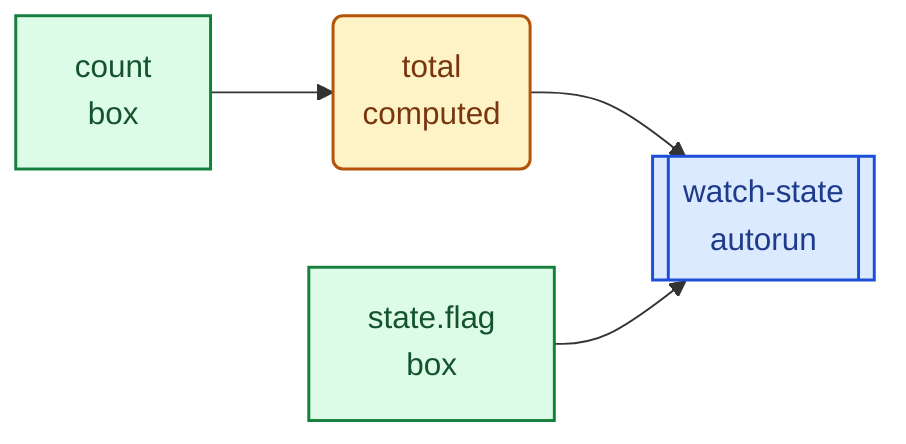

This guide shows how to use the current internal debug graph helpers to answer
the two hardest reactive debugging questions:

1. Why did this reaction run?
2. Why did this reaction not run?

The examples here use the current internal APIs from `@fobx/core/internals`.
They are published so people can experiment with them, but they still remain an
experimental internals surface rather than stable public API.

## 1. Enable the runtime

The debug graph only exists in debug-enabled builds.

```sh
FOBX_DEBUG=1 deno test --allow-env --allow-read
```

```ts
import {
  configureDebugTracking,
  resetDebugTracking,
} from "@fobx/core/internals"

resetDebugTracking()
configureDebugTracking({ maxEvents: 500 })
```

## 2. Run a small scenario

```ts
import {
  autorun,
  computed,
  observable,
  observableBox,
  runInTransaction,
} from "@fobx/core"
import {
  buildDebugMermaidGraph,
  buildDebugTextReport,
  buildDebugTraceSummary,
  explainDebugTarget,
  getDebugSnapshot,
} from "@fobx/core/internals"

const count = observableBox(2, { name: "count" })
const total = computed(() => count.get() * 3, { name: "total" })
const state = observable({ flag: true }, { name: "state" })

const dispose = autorun(() => {
  total.get()
  state.flag
}, { name: "watch-state" })

runInTransaction(() => {
  count.set(4)
  state.flag = false
})

const snapshot = getDebugSnapshot()
const text = buildDebugTextReport({ target: total, maxDepth: 2, limit: 40 })
const trace = buildDebugTraceSummary({ target: total, maxDepth: 2 })
const explanation = explainDebugTarget(total)
const mermaid = buildDebugMermaidGraph({ target: total, maxDepth: 2 })
```

## 3. See the same scenario through every format

All of the views below describe the exact same runtime state after this
transaction:

- `count` changed from `2` to `4`
- `state.flag` changed from `true` to `false`
- `total` recomputed from `6` to `12`
- `watch-state` reran after the batch drained

### Comparison matrix

| Format                                                   | Best at answering                                                            | Same-scenario takeaway                                                                                           |
| -------------------------------------------------------- | ---------------------------------------------------------------------------- | ---------------------------------------------------------------------------------------------------------------- |
| `buildDebugTextReport({ target: total, maxDepth: 2 })`   | What is the best terminal-friendly summary of graph plus causality?          | The dependency graph is printed first, then current values, then writes and downstream consequences              |
| `explainDebugTarget(total)`                              | What is this one node wired to right now?                                    | `total` depends on `count` and is observed by `watch-state`                                                      |
| `getDebugSnapshot()` node subset                         | What does the whole live graph currently look like?                          | `watch-state` currently depends on both `total` and `state.flag`                                                 |
| `buildDebugTraceSummary({ target: total, maxDepth: 2 })` | What values changed, in or out of a transaction, and what ran because of it? | `count` and `state.flag` changed inside the batch, then `total` updated after the batch drained                  |
| Snapshot-derived adjacency export                        | What are the dependency edges in plain data form?                            | `total -> count`, `watch-state -> total`, `watch-state -> state.flag`                                            |
| Snapshot-derived event timeline                          | In what order did writes, notify, schedule, and runs happen?                 | The timeline shows why `watch-state` reran instead of only showing that it did                                   |
| `buildDebugMermaidGraph({ target: total, maxDepth: 2 })` | What is the topology at a glance?                                            | `count -> total -> watch-state` and `state.flag -> watch-state`                                                  |
| Snapshot-derived source-group export                     | Which nodes came from the same source location?                              | In this ad hoc eval example the source groups are not interesting; this becomes useful in real app or test files |

### `buildDebugTextReport({ target: total, maxDepth: 2 })`

```text
FOBX DEBUG REPORT
  events: 5..32
  nodes: 4, changes: 4, consequences: 17

GRAPH
  count -> total
  state.flag -> watch-state
  total -> watch-state

CURRENT VALUES
  count [box] = 4
  total [computed, up-to-date] = 12
  state.flag [box] = false
  watch-state [autorun, up-to-date]

CHANGES
  [tx depth=1] count: 2 -> 4 (set-box)
  [tx depth=1] state.flag: true -> false (set-box)
  [post-tx] total: 6 -> 12 (computed:update)

CONSEQUENCES
  [tx depth=1] schedule total from count -> stale (observer-notified, changed)
  [tx depth=1] schedule watch-state from state.flag -> stale (already-queued-upgrade, changed)
  [post-tx] run-start watch-state from stale
  [post-tx] run-end watch-state -> up-to-date (completed)
```

This is often the most practical format in real projects because it stays
legible in terminals, CI logs, PR comments, and bug reports.

If the output gets too large, narrow it with:

- `target` to anchor the report on one computed or reaction
- `maxDepth` to keep only the nearby subgraph
- `limit` to cap the number of matching events included

### `explainDebugTarget(total)`

```json
{
  "node": "total",
  "dependencies": ["count"],
  "observers": ["watch-state"]
}
```

### `getDebugSnapshot()` node subset

```json
[
  {
    "name": "count",
    "kind": "box",
    "dependencyIds": [],
    "observerIds": [2],
    "value": "4"
  },
  {
    "name": "total",
    "kind": "computed",
    "dependencyIds": [1],
    "observerIds": [5],
    "value": "12"
  },
  {
    "name": "state.flag",
    "kind": "box",
    "dependencyIds": [],
    "observerIds": [5],
    "value": "false"
  },
  {
    "name": "watch-state",
    "kind": "autorun",
    "dependencyIds": [2, 4],
    "observerIds": []
  }
]
```

### `buildDebugTraceSummary({ target: total, maxDepth: 2 })`

```json
{
  "snapshot": [
    { "name": "count", "kind": "box", "value": { "preview": "4" } },
    { "name": "total", "kind": "computed", "value": { "preview": "12" } },
    { "name": "state.flag", "kind": "box", "value": { "preview": "false" } },
    { "name": "watch-state", "kind": "autorun" }
  ],
  "changes": [
    {
      "kind": "write",
      "nodeName": "count",
      "previousValue": { "preview": "2" },
      "value": { "preview": "4" },
      "inTransaction": true,
      "batchDepth": 1
    },
    {
      "kind": "write",
      "nodeName": "state.flag",
      "previousValue": { "preview": "true" },
      "value": { "preview": "false" },
      "inTransaction": true,
      "batchDepth": 1
    },
    {
      "kind": "write",
      "nodeName": "total",
      "previousValue": { "preview": "6" },
      "value": { "preview": "12" },
      "inTransaction": false,
      "batchDepth": 0
    }
  ],
  "consequences": [
    {
      "kind": "schedule",
      "nodeName": "total",
      "sourceName": "count",
      "inTransaction": true,
      "batchDepth": 1
    },
    {
      "kind": "schedule",
      "nodeName": "watch-state",
      "sourceName": "state.flag",
      "inTransaction": true,
      "batchDepth": 1
    },
    {
      "kind": "run-start",
      "nodeName": "watch-state",
      "inTransaction": false,
      "batchDepth": 0
    }
  ]
}
```

### Snapshot-derived adjacency export

```json
{
  "edges": [
    { "from": "total", "to": "count", "type": "depends-on" },
    { "from": "watch-state", "to": "total", "type": "depends-on" },
    { "from": "watch-state", "to": "state.flag", "type": "depends-on" }
  ]
}
```

### Snapshot-derived event timeline

```json
[
  {
    "id": 15,
    "kind": "write",
    "node": "count",
    "detail": "set-box",
    "inTransaction": true,
    "batchDepth": 1
  },
  {
    "id": 16,
    "kind": "notify",
    "node": "count",
    "detail": "observers=1",
    "inTransaction": true,
    "batchDepth": 1
  },
  {
    "id": 17,
    "kind": "schedule",
    "node": "total",
    "source": "count",
    "detail": "observer-notified",
    "inTransaction": true,
    "batchDepth": 1
  },
  {
    "id": 20,
    "kind": "write",
    "node": "state.flag",
    "detail": "set-box",
    "inTransaction": true,
    "batchDepth": 1
  },
  {
    "id": 22,
    "kind": "schedule",
    "node": "watch-state",
    "source": "state.flag",
    "detail": "already-queued-upgrade",
    "inTransaction": true,
    "batchDepth": 1
  },
  {
    "id": 25,
    "kind": "write",
    "node": "total",
    "detail": "computed:update",
    "inTransaction": false,
    "batchDepth": 0
  },
  {
    "id": 27,
    "kind": "schedule",
    "node": "watch-state",
    "source": "total",
    "detail": "already-queued-upgrade",
    "inTransaction": false,
    "batchDepth": 0
  },
  {
    "id": 29,
    "kind": "run-start",
    "node": "watch-state",
    "inTransaction": false,
    "batchDepth": 0
  }
]
```

### `buildDebugMermaidGraph({ target: total, maxDepth: 2 })`



If you only want one mental shortcut:

- text report: best terminal and log view
- explanation: current local wiring
- snapshot: current whole-graph state
- trace: values plus causal consequences
- timeline: exact order of events
- Mermaid: topology picture

## 4. Start with `explainDebugTarget`

This is usually the best first view because it answers “what is this node wired
to right now?” without forcing you to scan the whole graph.

### Example output

```json
{
  "node": "total",
  "dependencies": ["count"],
  "observers": ["watch-state"]
}
```

That tells you the computed `total` is currently depending on `count`, and the
autorun `watch-state` is observing `total`.

## 5. Inspect the raw snapshot

The full snapshot is useful when you want the entire live graph.

### Example node subset

```json
[
  {
    "id": 1,
    "name": "count",
    "kind": "box",
    "deps": [],
    "observers": [2],
    "disposed": false
  },
  {
    "id": 2,
    "name": "total",
    "kind": "computed",
    "deps": [1],
    "observers": [5],
    "disposed": false
  },
  {
    "id": 4,
    "name": "state.flag",
    "kind": "box",
    "deps": [],
    "observers": [5],
    "disposed": false
  },
  {
    "id": 5,
    "name": "watch-state",
    "kind": "autorun",
    "deps": [2, 4],
    "observers": [],
    "disposed": false
  }
]
```

The key read is the dependency chain:

- `total -> count`
- `watch-state -> total`
- `watch-state -> state.flag`

## 6. Start with the trace summary for causality

When the main question is “what value changed and what ran because of it?”, the
trace summary is the most direct view.

### Example shape

```json
{
  "snapshot": [
    { "name": "count", "kind": "box", "value": { "preview": "4" } },
    { "name": "total", "kind": "computed", "value": { "preview": "12" } },
    { "name": "watch-state", "kind": "autorun" }
  ],
  "changes": [
    {
      "kind": "write",
      "nodeName": "count",
      "previousValue": { "preview": "2" },
      "value": { "preview": "4" },
      "inTransaction": true,
      "batchDepth": 1
    },
    {
      "kind": "write",
      "nodeName": "total",
      "previousValue": { "preview": "6" },
      "value": { "preview": "12" },
      "inTransaction": false,
      "batchDepth": 0
    }
  ],
  "consequences": [
    {
      "kind": "schedule",
      "nodeName": "watch-state",
      "sourceName": "total",
      "inTransaction": true,
      "batchDepth": 1
    },
    {
      "kind": "run-start",
      "nodeName": "watch-state",
      "inTransaction": false,
      "batchDepth": 0
    }
  ]
}
```

That gives you the three views that matter most during debugging:

- the current values at inspection time
- the writes that happened, including previous and next values when available
- the notify, schedule, and run sequence that followed

## 7. Build richer exports from the snapshot

The current internal runtime exposes generic building blocks rather than many
specialized export functions. In practice, that is enough to derive several
useful tooling shapes.

### A. Adjacency export

This is the simplest graph-oriented export: nodes plus explicit directed edges.

```ts
const snapshot = getDebugSnapshot()
const nodesById = Object.fromEntries(
  snapshot.nodes.map((node) => [node.id, node]),
)

const adjacency = {
  nodes: snapshot.nodes.map((node) => ({
    id: node.id,
    name: node.name,
    kind: node.kind,
    sourceGroup: node.sourceGroup,
  })),
  edges: snapshot.nodes.flatMap((node) =>
    node.dependencyIds.map((depId) => ({
      from: node.name,
      to: nodesById[depId]?.name ?? depId,
      type: "depends-on",
    }))
  ),
}
```

#### Example output

```json
{
  "nodes": [
    { "id": 1, "name": "count", "kind": "box", "sourceGroup": null },
    { "id": 2, "name": "total", "kind": "computed", "sourceGroup": null },
    {
      "id": 3,
      "name": "state",
      "kind": "observable-object",
      "sourceGroup": null
    },
    { "id": 4, "name": "state.flag", "kind": "box", "sourceGroup": null },
    { "id": 5, "name": "watch-state", "kind": "autorun", "sourceGroup": null }
  ],
  "edges": [
    { "from": "total", "to": "count", "type": "depends-on" },
    { "from": "watch-state", "to": "total", "type": "depends-on" },
    { "from": "watch-state", "to": "state.flag", "type": "depends-on" }
  ]
}
```

This is a good shape for feeding graph UIs, DOT export, Cytoscape, or custom
visualizers.

### B. Event timeline export

This shape is better when your main question is causality rather than topology.

```ts
const timeline = snapshot.events.slice(-8).map((event) => ({
  id: event.id,
  kind: event.kind,
  detail: event.detail,
  node: event.nodeId ? nodesById[event.nodeId]?.name ?? event.nodeId : null,
  source: event.sourceId
    ? nodesById[event.sourceId]?.name ?? event.sourceId
    : null,
  target: event.targetId
    ? nodesById[event.targetId]?.name ?? event.targetId
    : null,
}))
```

#### Example output

```json
[
  {
    "id": 25,
    "kind": "write",
    "detail": "computed:update",
    "node": "total",
    "source": null,
    "target": null
  },
  {
    "id": 26,
    "kind": "notify",
    "detail": "observers=1",
    "node": "total",
    "source": null,
    "target": null
  },
  {
    "id": 27,
    "kind": "schedule",
    "detail": "already-queued-upgrade",
    "node": "watch-state",
    "source": "total",
    "target": null
  },
  {
    "id": 29,
    "kind": "run-start",
    "detail": null,
    "node": "watch-state",
    "source": null,
    "target": null
  },
  {
    "id": 30,
    "kind": "edge-add",
    "detail": null,
    "node": null,
    "source": "watch-state",
    "target": "total"
  },
  {
    "id": 31,
    "kind": "edge-add",
    "detail": null,
    "node": null,
    "source": "watch-state",
    "target": "state.flag"
  },
  {
    "id": 32,
    "kind": "run-end",
    "detail": "completed",
    "node": "watch-state",
    "source": null,
    "target": null
  }
]
```

This is often the clearest view for “why did this reaction run?” because it
shows the write, notify, schedule, edge rebuild, and run sequence directly.

### C. Source-group export

When the same reaction factory or observable creation site is producing many
instances, grouping by `sourceGroup` is useful.

```ts
const bySourceGroup = Object.values(
  snapshot.nodes.reduce((groups, node) => {
    const key = node.sourceGroup ?? "<unknown>"
    ;(groups[key] ??= []).push({
      id: node.id,
      name: node.name,
      kind: node.kind,
    })
    return groups
  }, {} as Record<string, Array<{ id: number; name: string; kind: string }>>),
)
```

That shape is helpful for answering questions like “which reaction instances
were created from this render site?” or “how many collection slot admins came
from this object property definition?”

## 8. Mermaid export

Mermaid is useful when you want a compact visual representation of the live
dependency graph.

### Example markup


### What that graph means

- `count` flows into `total`
- `total` flows into `watch-state`
- `state.flag` also flows directly into `watch-state`

That direction is intentional: the Mermaid export draws dependencies on the left
and consumers on the right so it reads like a dataflow diagram rather than an
owner-to-dependency pointer dump.

That is already enough to spot several classes of bugs:

- a reaction never subscribed to the node you expected
- a computed is reading more inputs than intended
- a conditional branch swapped dependencies between runs

## 9. A practical debugging sequence

When a reaction surprises you, this order is usually the most efficient:

1. Call `resetDebugTracking()` and rerun a minimal reproduction.
2. Start with `buildDebugTextReport({ target, maxDepth, limit })` when you want
   one terminal-friendly view that includes the local dependency graph and the
   causal trace together.
3. Use `buildDebugTraceSummary({ target })` when you want the structured data
   version of that same causal story.
4. Use `explainDebugTarget(reactionOrComputed)` to verify the current wiring.
5. If the wiring is wrong, inspect `dependencyIds`, `observerIds`, and recent
   `edge-add` / `edge-remove` events.
6. If the wiring is right but the behavior is wrong, inspect the event timeline
   around the write and schedule sequence.
7. Use Mermaid output for a fast visual sanity check.

## 10. Why these exports remain experimental

The current internals are already useful, but there are still open design
questions before any of this should be treated as public API:

- how many prebuilt export formats should exist vs. leaving them derived from
  `getDebugSnapshot()`?
- what should be considered stable in event payloads?
- what should the long-term contract be for causal trace summaries vs. raw event
  streams?

That is why these docs describe the APIs as experimental internals rather than
final public API documentation.
